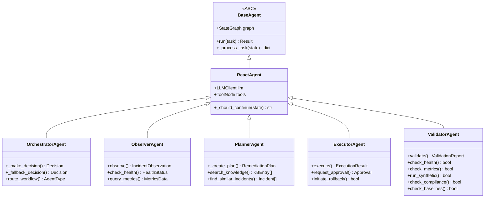

# Aegis — "Multi-Agent AI Incident Response Platform"
## Agent Architecture

## Purpose

Multi-agent architecture showing the 5 implemented agents, their base class hierarchy, and communication paths. Future agent types are separated visually.

## Source Traceability

| Component | Source | Status |
|---|---|---|
| BaseAgent (ABC) | `src/agents/base.py:44` | **Implemented** |
| ReactAgent | `src/agents/base.py:262` | **Implemented** |
| OrchestratorAgent | `src/agents/orchestrator.py:63` | **Implemented** |
| ObserverAgent | `src/agents/observer.py:70` | **Implemented** |
| PlannerAgent | `src/agents/planner.py:63` | **Implemented** |
| ExecutorAgent | `src/agents/executor.py:62` | **Implemented** |
| ValidatorAgent | `src/agents/validator.py:76` | **Implemented** |
| StateGraph | `src/agents/base.py` (LangGraph) | **Implemented** |
| ActionDispatcher | `src/core/action_dispatcher.py` | **Implemented** |
| RCA_ANALYZER | `src/core/models.py:87` | **Future** |
| HEALING_AGENT | `src/core/models.py:88` | **Future** |
| TICKET_ROUTER | `src/core/models.py:89` | **Future** |
| PRIORITIZER | `src/core/models.py:90` | **Future** |
| PREDICTOR | `src/core/models.py:91` | **Future** |

## Mermaid Specification — Class Hierarchy



## Mermaid Specification — Communication Paths

```mermaid
graph LR
    subgraph "Implemented Agents"
        ORC[Orchestrator]
        OBS[Observer]
        PLN[Planner]
        EXE[Executor]
        VAL[Validator]
    end

    subgraph "Future Agents"
        RCA[RCA Analyzer]
        HEAL[Healing Agent]
        ROUT[Router]
        PRIO[Prioritizer]
        PRED[Predictor]
    end

    INC[Incident] --> ORC
    ORC --> OBS : delegate observation
    OBS --> ORC : IncidentObservation
    ORC --> PLN : delegate planning
    PLN --> ORC : RemediationPlan
    ORC --> EXE : delegate execution
    EXE --> ORC : ExecutionResult
    ORC --> VAL : delegate validation
    VAL --> ORC : ValidationReport
    ORC --> INC : update status

    ORC -.-> RCA
    ORC -.-> HEAL
    ORC -.-> ROUT
    ORC -.-> PRIO
    ORC -.-> PRED

    style ORC fill:#4a9,color:#fff
    style OBS fill:#4a9,color:#fff
    style PLN fill:#4a9,color:#fff
    style EXE fill:#4a9,color:#fff
    style VAL fill:#4a9,color:#fff
    style RCA fill:#666,color:#fff,stroke-dasharray: 5 5
    style HEAL fill:#666,color:#fff,stroke-dasharray: 5 5
    style ROUT fill:#666,color:#fff,stroke-dasharray: 5 5
    style PRIO fill:#666,color:#fff,stroke-dasharray: 5 5
    style PRED fill:#666,color:#fff,stroke-dasharray: 5 5
    style INC fill:#e8e8e8,color:#333
```

## Labels

- **Implemented:** BaseAgent, ReactAgent, OrchestratorAgent, ObserverAgent, PlannerAgent, ExecutorAgent, ValidatorAgent
- **Future:** RCA_ANALYZER, HEALING_AGENT, TICKET_ROUTER, PRIORITIZER, PREDICTOR (defined in AgentType enum, no class exists)

## Validation Criteria

- [ ] Base class hierarchy matches `src/agents/base.py`: BaseAgent(ABC) → ReactAgent → each agent
- [ ] All 5 agent classes exist in `src/agents/` with correct names
- [ ] Future agent types match `AgentType` enum in `src/core/models.py:79-91`
- [ ] Communication paths match orchestrator routing in `src/agents/orchestrator.py`
- [ ] Future agents are visually distinguished (dashed border, grey fill)
