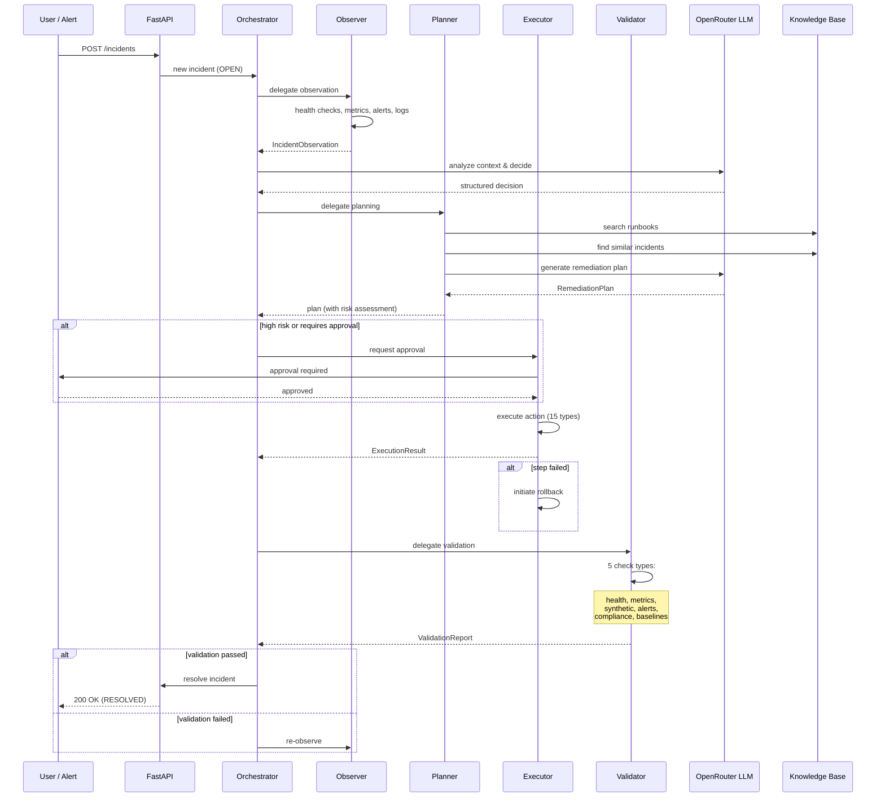
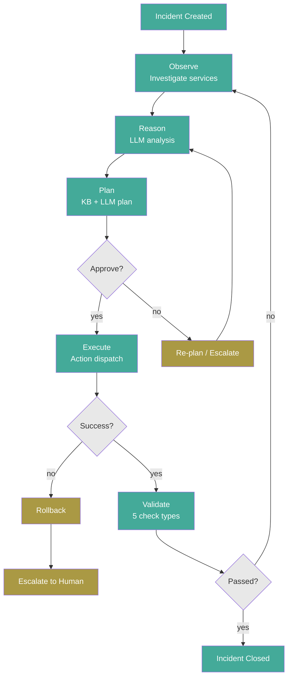

# Aegis — "Multi-Agent AI Incident Response Platform"
## Agent Interaction Diagram

## Purpose

Runtime communication flow showing how an incident progresses through the agent pipeline: creation → observation → reasoning → planning → approval → execution → validation → closure.

## Source Traceability

| Step | Agent | Source | State Transition |
|---|---|---|---|
| Incident Created | Orchestrator | `src/api/routes/incidents.py:111` | OPEN |
| Observe | Observer | `src/agents/observer.py` | INVESTIGATING |
| Reason | Orchestrator | `src/agents/orchestrator.py:_make_decision()` | INVESTIGATING |
| Plan | Planner | `src/agents/planner.py:_create_plan()` | PLANNING |
| Approve | Executor | `src/core/approval.py` | PENDING_APPROVAL |
| Execute | Executor | `src/agents/executor.py:115-253` | EXECUTING |
| Validate | Validator | `src/agents/validator.py:162-294` | VALIDATING |
| Close | Orchestrator | `src/agents/orchestrator.py` | RESOLVED → CLOSED |

## Mermaid Specification

## Flow Diagram

## Labels

- **Implemented:** All steps (Observe, Reason, Plan, Approve, Execute, Validate, Close)
- **Implemented:** LLM interaction, Knowledge Base search, Action dispatch, Rollback

## Validation Criteria

- [ ] Sequence of agents matches `src/agents/orchestrator.py` routing logic
- [ ] Each agent's role matches its implementation in `src/agents/`
- [ ] Feedback loop (re-observe on validation failure) matches `src/agents/validator.py` response handling
- [ ] Approval gate matches `src/core/approval.py`
- [ ] Rollback path matches `src/agents/executor.py:initiate_rollback()`
