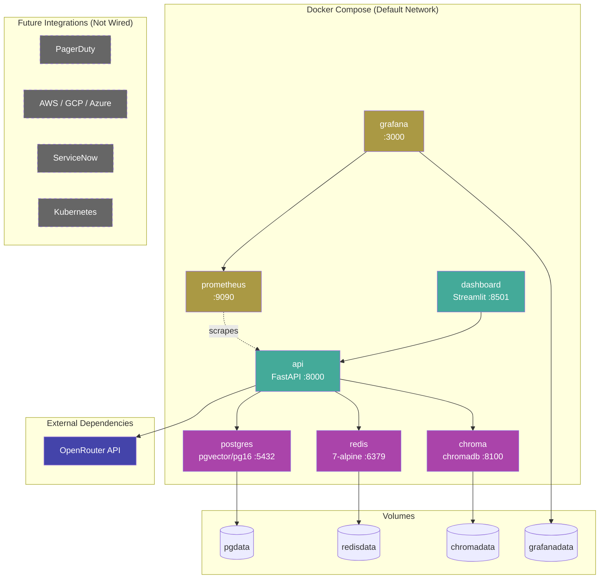

# Aegis — "Multi-Agent AI Incident Response Platform"
## Deployment Diagram

## Purpose

Docker Compose deployment topology showing all 7 services, their dependencies, port mappings, and external LLM dependency. Future integrations shown separately.

## Source Traceability

| Service | Image | Port | Depends On | Health Check | Source | Status |
|---|---|---|---|---|---|---|
| api | Custom build | 8000 | postgres, redis | /health | `Dockerfile` | **Implemented** |
| dashboard | Custom build | 8501 | api | /health | `src/dashboard/app.py` | **Implemented** |
| postgres | pgvector/pg16 | 5432 | — | pg_isready | `docker-compose.yml` | **Implemented** |
| redis | redis:7-alpine | 6379 | — | redis-cli ping | `docker-compose.yml` | **Implemented** |
| chroma | chromadb/chroma:latest | 8100 | — | heartbeat API | `docker-compose.yml` | **Implemented** |
| prometheus | prom/prometheus:latest | 9090 | — | /-/healthy | `config/prometheus.yml` | **Implemented** |
| grafana | grafana/grafana:latest | 3000 | prometheus | /health | `docker-compose.yml` | **Implemented** |

## Mermaid Specification

## Status Legend

| Colour | Status |
|---|---|
| Green (#4a9) | Application services — **Implemented** |
| Purple (#a4a) | Data services — **Implemented** |
| Amber (#a94) | Monitoring services — **Implemented** |
| Blue (#44a) | External dependency — **Implemented** |
| Grey dashed (#666) | Future — **Configured but not wired** |

## Validation Criteria

- [ ] All 7 Docker services match `docker-compose.yml` exactly
- [ ] Ports match: 8000, 8501, 5432, 6379, 8100, 9090, 3000
- [ ] Dependencies: api depends on postgres+redis; dashboard depends on api; grafana depends on prometheus
- [ ] Volumes match: pgdata, redisdata, chromadata, grafanadata
- [ ] No custom Docker networks (compose uses default)
- [ ] Future integrations visually distinguished (dashed border, grey)
- [ ] OpenRouter LLM shown as external dependency (not in compose)
