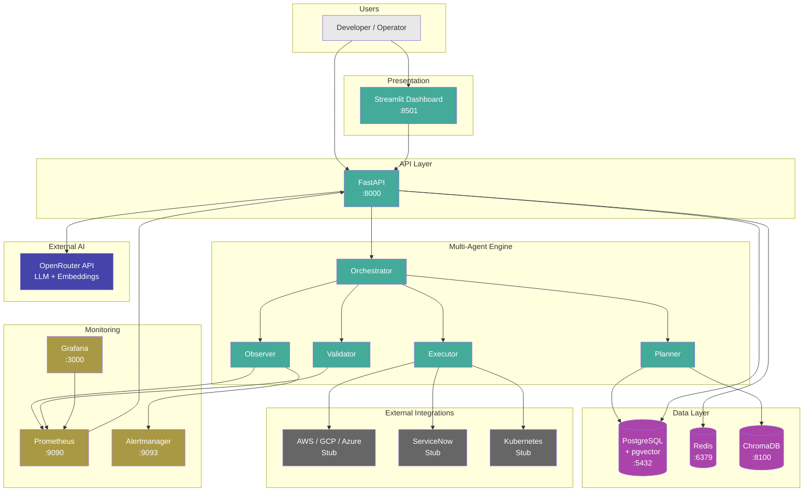

# Aegis — "Multi-Agent AI Incident Response Platform"
## High Level Architecture

## Purpose

Enterprise architecture showing Users → Dashboard → FastAPI → AI Agents → Data Layer → External Integrations.

## Source Traceability

| Component | Source | Status |
|---|---|---|
| Streamlit Dashboard | `src/dashboard/app.py` | **Implemented** |
| FastAPI (port 8000) | `src/api/app.py`, `src/main.py` | **Implemented** |
| AI Agents (5) | `src/agents/` | **Implemented** |
| PostgreSQL + pgvector | `src/core/database.py`, `docker-compose.yml` | **Implemented** (data engine) |
| Redis | `src/core/config.py`, `docker-compose.yml` | **Implemented** (cache engine) |
| ChromaDB | `src/core/vector_db.py`, `docker-compose.yml` | **Implemented** |
| Prometheus | `src/core/monitoring.py`, `docker-compose.yml` | **Implemented** |
| Grafana | `docker-compose.yml` | **Implemented** |
| LLM (OpenRouter) | `src/core/config.py`, `src/agents/base.py` | **Implemented** |
| PagerDuty | `src/core/config.py` | **Configured (not wired)** |
| Alertmanager | `src/core/monitoring.py` | **Implemented** |
| Cloud SDKs | `src/agents/executor.py:379-393` | **Stub** |
| ServiceNow | `src/agents/executor.py:396-408` | **Stub** |
| Kubernetes | `src/agents/executor.py:362-376` | **Stub** |

## Mermaid Specification

## Status Legend

| Colour | Status |
|---|---|
| Green (#4a9) | **Implemented** — code exists and is wired |
| Purple (#a4a) | **Implemented** — service configured, engine ready |
| Amber (#a94) | **Implemented** — configured and running |
| Blue (#44a) | **Implemented** — external dependency |
| Grey (#666) | **Stub** — function exists, returns placeholder |

## Validation Criteria

- [ ] All 7 Docker services from `docker-compose.yml` represented
- [ ] Agent count matches 5 implemented agents in `src/agents/`
- [ ] Stub integrations visually distinguished (grey)
- [ ] Relationship direction matches actual data flow
- [ ] Port numbers match docker-compose.yml
