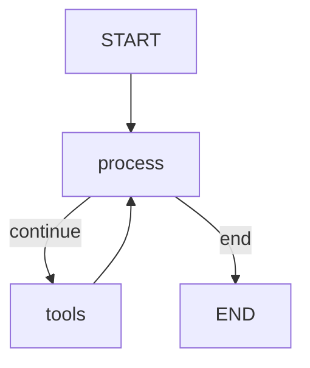

# Aegis — "Multi-Agent AI Incident Response Platform"
## Agent Architecture

## Purpose

Document the design and implementation of all AI agents, their base classes, state management, and shared infrastructure.

## Source Traceability

| Component | File |
|---|---|
| Base agent abstract class | `src/agents/base.py` |
| ReAct agent pattern | `src/agents/base.py:ReactAgent` |
| Agent factory | `src/agents/base.py:get_agent()` |
| Base state model | `src/agents/base.py:BaseAgentState` |
| Orchestrator agent | `src/agents/orchestrator.py` |
| Planner agent | `src/agents/planner.py` |
| Executor agent | `src/agents/executor.py` |
| Observer agent | `src/agents/observer.py` |
| Validator agent | `src/agents/validator.py` |
| Agent configuration | `src/core/config.py:AgentSettings` |
| Agent type enum | `src/core/models.py:AgentType` |

## Base Class Hierarchy

```
BaseAgent (ABC)
└── ReactAgent
    ├── OrchestratorAgent
    ├── PlannerAgent
    ├── ExecutorAgent
    ├── ObserverAgent
    └── ValidatorAgent
```

### BaseAgent (`src/agents/base.py`)

Abstract base class providing:
- **LLM initialization** via `_create_llm()` — creates a `ChatOpenAI` instance from agent config
- **LangGraph state graph** via `_build_graph()` — process-first, conditional edges to tool node
- **Execution lifecycle** via `execute()` — builds initial state, runs graph, extracts AgentResult
- **Health checks** via `health_check()` — reports initialization status and configuration

Abstract methods each agent must implement:
| Method | Purpose |
|---|---|
| `_get_system_prompt()` | Agent-specific system prompt |
| `_get_tools()` | List of tools available to the agent |
| `_get_state_class()` | Pydantic state class for this agent |
| `_process_task()` | Main task processing logic |

### ReactAgent (`src/agents/base.py`)

Extends BaseAgent with the ReAct (Reasoning + Acting) pattern:
1. System prompt + context → HumanMessage → LLM invocation
2. If response contains tool_calls → graph routes to ToolNode
3. Tool results feed back into next iteration
4. Repeats until no tool calls or max iterations reached

## State Management

Each agent has a dedicated state class extending `BaseAgentState`:

| State Class | Agent | Extra Fields |
|---|---|---|
| `BaseAgentState` | All agents | task, messages, intermediate_results, error, should_continue, iterations |
| `OrchestratorState` | Orchestrator | incident, decisions, completed_agents, pending_approvals |
| `PlannerState` | Planner | incident, plan, knowledge_matches, similar_incidents |
| `ExecutorState` | Executor | incident, plan, execution, current_step, approval_pending |
| `ObserverState` | Observer | incident, observation, monitoring_config, consecutive_degraded |
| `ValidatorState` | Validator | incident, execution_id, validation_report, required_checks |

## Agent Factory

The `get_agent()` function in `src/agents/base.py` provides lazy singleton initialization:

```python
_agent_instances: dict[AgentType, BaseAgent] = {}

def get_agent(agent_type: AgentType) -> BaseAgent:
    if agent_type not in _agent_instances:
        # Instantiate and cache the agent
    return _agent_instances[agent_type]
```

Supported agent types: ORCHESTRATOR, PLANNER, EXECUTOR, OBSERVER, VALIDATOR.

Additional agent types defined in `AgentType` enum but not implemented: RCA_ANALYZER, HEALING_AGENT, TICKET_ROUTER, PRIORITIZER, PREDICTOR.

## Graph Execution Flow

Each agent uses a LangGraph `StateGraph` with:
1. **Entry node** — `process` (calls `_process_task`)
2. **Conditional edge** — `_should_continue` routes to `tools` or `end`
3. **Tool node** — `ToolNode` wrapping the agent's tools
4. **Edge back** — `tools` → `process` for next iteration
5. **Checkpointer** — `MemorySaver` for state persistence



## Tool Architecture

Tools are defined as `@tool`-decorated async functions within each agent module. They are bound to the LLM during initialization:

| Agent | Tools | Lines |
|---|---|---|
| Orchestrator | None (decision-making only) | — |
| Planner | search_knowledge_base, find_similar_incidents, get_resource_topology, validate_plan | `planner.py:212-268` |
| Executor | execute_action, request_approval, check_action_status, initiate_rollback, update_incident_status, collect_logs, run_shell_command, kubernetes_action, cloud_action, servicenow_action | `executor.py:256-409` |
| Observer | check_service_health, query_metrics, get_active_alerts, check_dependencies, analyze_logs, get_deployment_status, correlate_events | `observer.py:288-359` |
| Validator | check_service_health, query_metrics, run_synthetic_test, verify_alert_resolution, check_compliance, compare_baselines, validate_rollback | `validator.py:297-367` |

## Agent Configuration

Default settings in `AgentSettings` (`src/core/config.py:105-138`):
- **Models:** All agents default to `nvidia/nemotron-3-ultra-550b-a55b:free`
- **Temperature:** 0.1
- **Max tokens:** 4096
- **Timeout:** 300 seconds
- **Max retries:** 3
- **Memory:** Enabled with window of 10
- **Tools:** Shell, K8s, Cloud, ServiceNow, monitoring — all enabled by default
